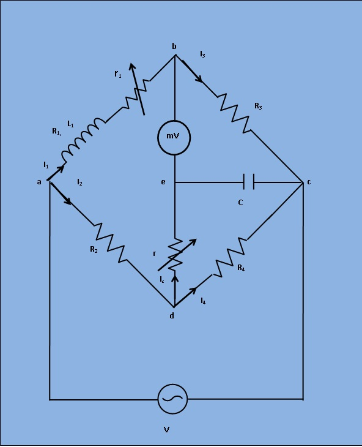

## Procedure

***Fig. 1. Circuit digram of experimental set-up for Measurement of Self Inductance by Anderson's Bridge***

1)  Apply Supply voltage (3V) from the signal generator with arbitrary frequency. ( say 50Hz). Also Set the value of the unknown air cored coil from <b>'Set Inductor Value'</b> tab
  
2)  Then switch on the supply to get millivoltmeter deflection.
  
3)  Choose the values of   r1, R2, R3, R4, r, and C from the resistance and capacitance box. Varry the values to some particular values to achieve <b> "Null"</b>.
  
4) Observe the millivoltmeter pointer to achieve "NULL".
  
5) If "Null" is achieved, switch to <b>'Measure Inductor Value' </b> tab and click on <b>'Simulate' </b>. Observe calculated values of unknown Inductor (L1) and it's Internal Resistance (R1).
  
6) Also observe the Dissipation factor of the unknwown capacitor which is defined as   `(omegaL)/r`.  Where, `omega=2pif`.

