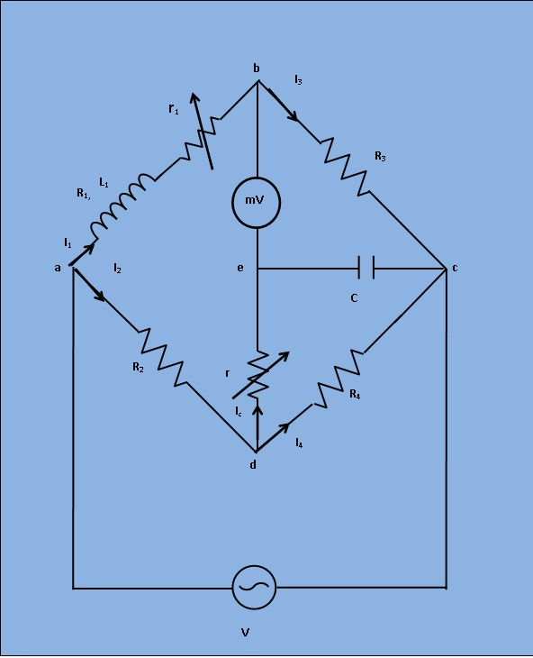

## Introduction

This bridge is a modification of the maxwell's inductive and capacitive bridge. In this method, the self inductance is measured in terms of a standard capacitor. This method is applicable for precise measurement of self inductance over wide range of values. Figure 1 shows the circuit diagram of the bridge for balance conditions.

***Fig 1: Circuit diagram for Measurement of Self Inductance by Anderson's Bridge***

Let, `L_1`=Self inductance is to be measured.
       `R_1`= Resistance of self inductor.
       `r_1`= Resistance connected in series with self inductor.
       `r,R_2,R_3,R_4`= Known non inductive resistances.
       `C`= Fixed standard capacitor.
       

At balance,  

`I_1= I_3 and I_2=I_C+I_4`

now,

`I_1R_3 =I_C/(jomegaC)`          then    `I_C=I_1jomegaCR_3...(1)`

Writing the other balance equations,

`I_1(r_1+R_1+jomegaL_1) = I_2R_2+rI_C...(2)`

`I_C(r+1/(jomegaC)) = (I_2-I_C)R_4`

Substituting the value of `I_C` in equation (2) , we get

`I_1(r_1+R_1+jomegaL_1) = I_2R_2+I_1jomegaCrR_3`

or,

`I_1(r_1+R_1+jomegaL_1-jomegaCrR_3) = I_2R_2...(3)`

and

`jomegaCR_3I_1(r+1/(jomegaC)) = (I_2-I_1jomegaCR_3)R_4`

or,

`I_1(jomegaCrR_3+jomegaCR_3R_4) = I_2R_4...(4)`

From equations (3) and (4) , we get by equating real and imaginary parts,

`R_1 = (R_2R_3)/R_4-r_1...(5)`

`L_1 = C(R_3/R_4)[r(R_4+R_2)+R_2R_4]...(6)`

An examination of balance equation reveals that to obtain easy convergence of balance , alternate adjustments of `r_1` and `r` should be done as they appear in only equ. (1) and (2).
